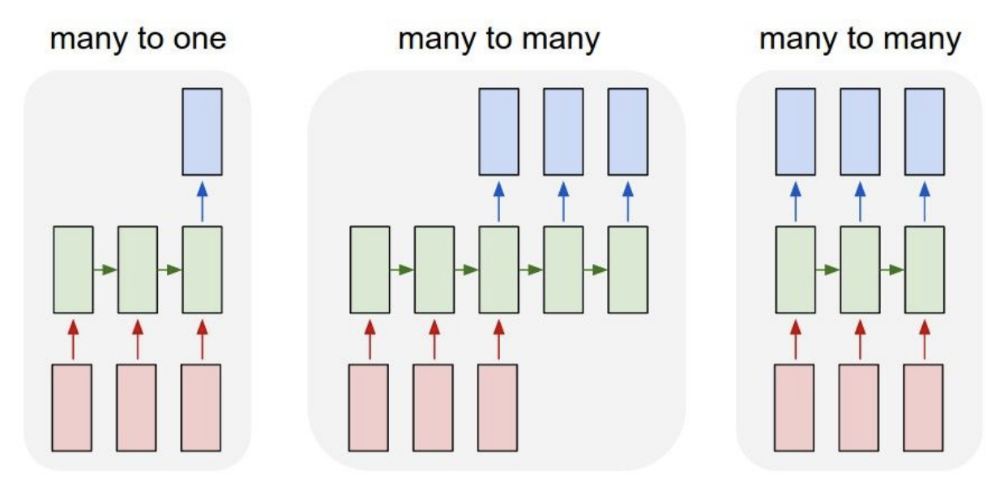

We're gonna work with the `sunspot.month` dataset

> Monthly numbers of sunspots, as from the World Data Center, aka SIDC. This is the version of the data that will occasionally be updated when new counts become available.

```{r}
sunspot.month
```

```{r}
library(tidyverse)
library(tsibble)
sunspot.month %>%
  as_tsibble() %>%
  ggplot(aes(index, value)) +
  geom_line()
```


The goal of this exercise will be to build a model that takes 10 years' worth of data (120 observations) and predict the next 10 years (120 observations).

# One problem, four ways

We'll go through four different ways to attack this problem (did I mention there's a bazillion of them?). Our approaches will correspond to each of these diagrams:

```{r echo = FALSE}

```

## First way: one step at a time

As a first attempt, we're going to set up our model so that our response variable is one time step, and our predictors are the 120 values preceding the response. This corresponds to the "many to one" picture in the diagram.

We need to do some data prep first:

```{r}
library(lubridate)
library(keras)

make_series <- function(column, start_offset, end_offset) {
  # Given a time series, return a list
  #  where each element is a vector representing a window
  #  of the time series determined by the offsets
  purrr::map(seq_along(column),
             function(x) {
               start <- max(0, x + start_offset)
               end <- max(0, x + end_offset)
               column[start:end]
             })
}

make_scaler <- function(x) {
  scaled <- scale(x)
  center_value <- attr(scaled, "scaled:center")
  scale_value <- attr(scaled, "scaled:scale")
  list(
    scaler = function(x) {
      force(x)
      scale(x, center_value, scale_value)
    },
    descaler = function(x) {
      force(x)
      x * scale_value + center_value
    }
  )
}

c(scale_value, descale_value) %<-% make_scaler(
  window(sunspot.month, 1749, c(1992, 12))
)

train_range <- 1749:1992
validation_range <- 1993:2002
testing_range <- 2003:2012
timesteps <- 120

data <- sunspot.month %>%
  as_tsibble() %>%
  as_data_frame() %>%
  mutate(key = case_when(
    year(index) %in% train_range ~ "train",
    year(index) %in% validation_range ~ "validation",
    year(index) %in% testing_range ~ "testing"
  )) %>%
  mutate(scaled_value = scale_value(value) %>%
           as.vector()) %>%
  mutate(lookback = make_series(scaled_value, -timesteps, -1),
         target = make_series(scaled_value, 0, timesteps - 1),
         target_lag = make_series(scaled_value, -1, timesteps - 2))

glimpse(data)
```

We also need to massage our data into a format that Keras can consume:

```{r}
make_keras_data <- function(data) {
  x <- data$lookback %>%
    array_reshape(c(length(data$lookback), timesteps, 1))
  y_sequence <- data$target %>%
    array_reshape(c(length(data$target), timesteps, 1))
  y_sequence_lag <- data$target_lag %>%
    array_reshape(c(length(data$target_lag), timesteps, 1))
  y <- data$target %>%
    sapply(first)
  list(x = x, y = y, y_sequence = y_sequence,
       y_sequence_lag = y_sequence_lag)
}

training_data <- data %>%
  filter(year(index) > 1758,
         key == "train") %>%
  make_keras_data()

validation_data <- data %>%
  filter(key == "validation") %>%
  make_keras_data()

full_training_data <- data %>%
  filter(key != "testing", year(index) > 1758) %>%
  make_keras_data()

prediction_data <- data %>%
  filter(year(index) == 2003, month(index) == 1) %>%
  make_keras_data()

str(training_data)
```

Let's now define our model.

```{r}
model <- keras_model_sequential() %>%
  layer_lstm(units = 128, input_shape = c(timesteps, 1)) %>%
  layer_dense(1)

model %>% 
  compile(optimizer='adam', loss='mse')

model
```

Let's see if it learns!

```{r}
history <- model %>% fit(
  training_data$x, 
  training_data$y,
  batch_size = 256,
  epochs = 20,
  validation_data = list(
    validation_data$x,
    validation_data$y
  )
)
plot(history)
```

After we're done tweaking the model, we can train it on the full dataset:

```{r}
model <- keras_model_sequential() %>%
  layer_lstm(units = 128, input_shape = c(timesteps, 1)) %>%
  layer_dense(1)

model %>% 
  compile(optimizer='adam', loss='mse')

history <- model %>% fit(
  full_training_data$x,
  full_training_data$y,
  batch_size = 256,
  epochs = 20,
)
```

Since the model outputs only one prediction, and we need 120, we need to come up with a scheme to do that. The tricky part here is that for any value more than one time step into the future, we're missing some previous values. To work around this, we're going to feed back the predictions iteratively:

```{r}
forecast_future_values <- function(model, x, steps) {
  forecasted <- numeric(0)
  for (i in seq_len(steps)) {
    x_reshaped <- array_reshape(x, c(1, timesteps, 1))
    next_value <- model %>%
      predict(x_reshaped) %>%
      as.vector()
    
    forecasted <- c(forecasted, next_value)
    x <- c(x[-1], next_value)
  }
  forecasted
}

predictions <- forecast_future_values(model, prediction_data$x, 12*10) %>% 
  descale_value()

predictions
```

Let's see how our model did:

```{r}
plot_predictions <- function(data, predictions) {
  data %>% 
    filter(key == "testing") %>% 
    add_column(prediction = predictions) %>%
    rbind(data %>%
            filter(key != "testing",
                   year(index)> 1980) %>%
            add_column(prediction = NA_real_)
    ) %>%
    select(index, value, prediction) %>%
    gather(key, value, value, prediction) %>%
    ggplot(aes(x = index, y = value, color = key)) +
    geom_line()
}

plot_predictions(data, predictions)
```

## Second way: have the dense layer output `timesteps` numbers

The only difference compared to the previous approach is that we're outputing a vector of 120 steps instead of 1. This still corresponds to the "many to one" picture.

```{r}
model <- keras_model_sequential() %>%
  layer_lstm(units = 128, input_shape = c(timesteps, 1)) %>%
  layer_dense(timesteps) %>%
  layer_reshape(c(timesteps, 1))

model %>% 
  compile(optimizer='adam', loss='mse')
```

We also need to tweak our training dataset to accommdate the new model structure. Since the `y_sequence` output of `make_keras_data()` looks two years into the future, we need to make sure we're not cheating:

```{r}
training_data <- data %>%
  filter(year(index) > 1758,
         year(index) < (min(validation_range) - 10)) %>%
  make_keras_data()

validation_data <- data %>%
  filter(year(index) >= (min(validation_range) - 10),
         year(index) < (min(testing_range) - 10)) %>%
  make_keras_data()

full_training_data <- data %>%
  filter(year(index) > 1758,
         year(index) < (min(testing_range) - 10)) %>%
  make_keras_data()
```

We'll also skip the tuning the model since we're focusing on the high level architecture.

```{r}
history <- model %>% fit(
  full_training_data$x,
  full_training_data$y_sequence,
  batch_size = 256,
  epochs = 20,
)

predictions <- model %>%
  predict(prediction_data$x) %>%
  descale_value() %>%
  as.vector()

plot_predictions(data, predictions)
```

## Third way: "time distributed" dense layer

We're on a roll! In this next approach, we're going to set `return_sequences = TRUE` in the LSTM layer; what this does is output a prediction for each of the steps in the input sequence. This corresponds to the right-most "many to many" diagram. Since the format of the training dataset is the same, we can just define the model and start training:

```{r}
model <- keras_model_sequential() %>%
  layer_lstm(units = 128, input_shape = c(timesteps, 1),
             return_sequences = TRUE) %>%
  layer_dense(1)

model %>% 
  compile(optimizer='adam', loss='mse')

history <- model %>% fit(
  full_training_data$x,
  full_training_data$y_sequence,
  batch_size = 256,
  epochs = 20,
)

predictions <- model %>%
  predict(prediction_data$x) %>%
  descale_value() %>%
  as.vector()

plot_predictions(data, predictions)
```

## Fourth way: Seq2seq/Encoder-decoder architecture

Our final approach is slightly more involved, and it corresponds to the middle "many to many" picture. We have an *encoder* network that summarizes the historical data into some numbers, and we also have a *decoder* network that translates these summary numbers into a forecast sequence. Each step in the prediction depends on the output and hidden state of the previous time stemp. During training, we provide the actual lagged values, and during prediction, we feed back the prediction for the previous timestep into the network. Let's now build the model.

```{r}
# specify the dimension of the LSTM layer
latent_dim <- 128
# takes an input sequence, runs it through a recurrent layer,
#   then return the hidden states
encoder_inputs  <- layer_input(shape = list(timesteps, 1))
encoder_results <- encoder_inputs %>%
  layer_lstm(units = latent_dim, return_state = TRUE)
# the hidden states are saved in the 2nd and 3rd elements of the list
encoder_states <- encoder_results[2:3]

# takes the values prior to the value before forecasted
#   and feeds it to an lstm with hidden state initialized using
#   the encoder states
decoder_inputs  <- layer_input(shape = list(NULL, 1))
decoder_lstm <- layer_lstm(
  units = latent_dim, return_sequences = TRUE,
  return_state = TRUE)
decoder_results <- decoder_inputs %>%
  decoder_lstm(initial_state = encoder_states)
# since we have `return_sequences = TRUE`, this dense layer
#   would return a scalar for each step in the `decoder_inputs`
#   sequence
decoder_dense <- layer_dense(units = 1, activation = "linear")
decoder_outputs <- decoder_results[[1]] %>%
  decoder_dense()

model <- keras_model(
  inputs = list(encoder_inputs, decoder_inputs),
  outputs = decoder_outputs
)
```

Let's now compile and fit the model:

```{r}
model %>% 
  compile(optimizer='adam', loss='mse')

history <- model %>% fit(
  list(full_training_data$x, full_training_data$y_sequence_lag), 
  full_training_data$y_sequence,
  batch_size = 256,
  epochs = 20
  )
```

During prediction, we need a way to pass states from one step to the next, so we need to put together encoder and decoder models using the layers that have been trained above:

```{r}
# the encoder model takes input values and return states
encoder_model <-  keras_model(encoder_inputs, encoder_states)

# the decoder model takes both the previous timestep's value and
#  its state outputs and returns a prediction along with the new states
decoder_state_input_h <- layer_input(shape = latent_dim)
decoder_state_input_c <- layer_input(shape = latent_dim)
decoder_states_inputs <- c(decoder_state_input_h, decoder_state_input_c)
decoder_results <- decoder_lstm(decoder_inputs, initial_state = decoder_states_inputs)
decoder_states  <- decoder_results[2:3]
decoder_outputs <- decoder_dense(decoder_results[[1]])
decoder_model   <- keras_model(
  inputs  = c(decoder_inputs, decoder_states_inputs),
  outputs = c(decoder_outputs, decoder_states)
)
```

We can now define a forecasting function using these models and make some predictions

```{r}
forecast_values_seq2seq <- function(input_seq, encoder, decoder, steps = 120) {
  states_value <- predict(encoder, input_seq)
  target_seq <- array(tail(input_seq[1,,], 1), dim=c(1, 1, 1))
  forecasted_sequence <- numeric(0)

  for (i in seq_len(steps)) {
    decoder_predict <- predict(decoder, c(list(target_seq), states_value))
    output_value <- decoder_predict[[1]]
    
    forecasted_sequence <-  c(forecasted_sequence, output_value)
    forecasted_sequence
    
    target_seq <- array(output_value, dim=c(1, 1, 1))
    
    ## update states
    h <- decoder_predict[[2]]
    c <- decoder_predict[[3]]
    states_value = list(h, c)
  }    
  forecasted_sequence
}

predictions <- forecast_values_seq2seq(
  prediction_data$x, encoder_model, decoder_model
  ) %>% descale_value()
```

Then plot the predictions
```{r}
plot_predictions(data, predictions)
```


